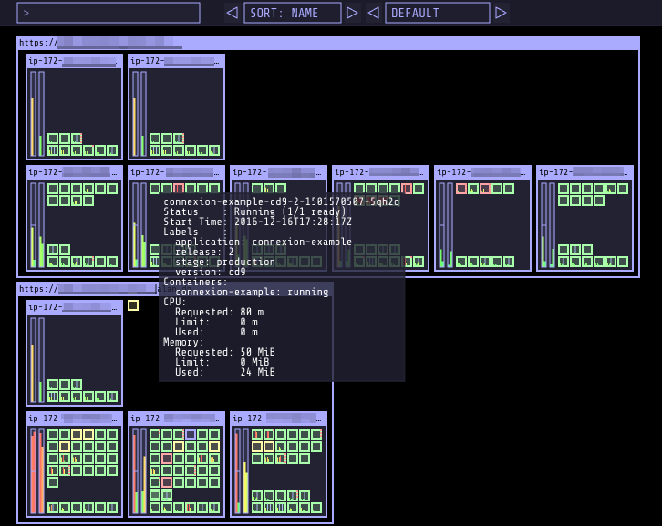

Kubernetes Operational View
===========================



Goal: provide a common operational picture for multiple Kubernetes
clusters.

-   Render nodes and indicate their overall status (\"Ready\")
-   Show node capacity and resource usage (CPU, memory)
    -   Render one \"box\" per CPU and fill up to sum of pod CPU
        requests/usage
    -   Render vertical bar for total memory and fill up to sum of pod
        memory requests/usage
-   Render individual pods
    -   Indicate pod status by border line color (green: ready/running,
        yellow: pending, red: error etc)
    -   Show current CPU/memory usage (gathered from Heapster) by small
        vertical bars
    -   System pods (\"kube-system\" namespace) will be grouped together
        at the bottom
-   Provide tooltip information for nodes and pods
-   Animate pod creation and termination

What it is not:

-   It\'s not a replacement for the [Kubernetes
    Dashboard](https://github.com/kubernetes/dashboard). The Kubernetes
    Dashboard is a general purpose UI which allows managing
    applications.
-   It\'s not a monitoring solution. Use your preferred monitoring
    system to alert on production issues.
-   It\'s not a operation management tool. Kubernetes Operational View
    does not allow interacting with the actual cluster.

Usage
-----
Openshift:
``` {.sourceCode .bash}
oc new-project ocp-ops-view
oc adm policy add-scc-to-user anyuid -z default -n ocp-ops-view
oc apply -f ocp-ops-view.yaml
```

Credits:
-----
Henning Jacobs: https://codeberg.org/hjacobs/kube-ops-view
raffaelespazzoli: https://github.com/raffaelespazzoli/kube-ops-view
